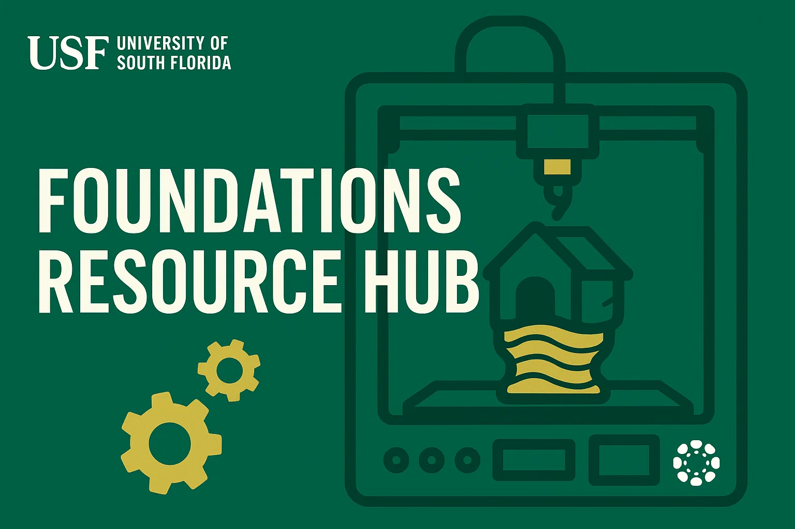

# The Foundations Resource Hub

Welcome to The Foundations Resource Hub, a repository dedicated to teaching students the programming, circuit design, and digital fabrication skills used in the Foundations of Engineering Lab (EGN 3000L) course at the University of South Florida. It covers Arduino-based microcontroller programming, practical electronics, and 3D printing workflows. Documentation is organized into dedicated sections for programming, 3D printing, and course assignments so you can easily navigate to the material you need. It is written in Markdown and intended to be read on GitHub.
