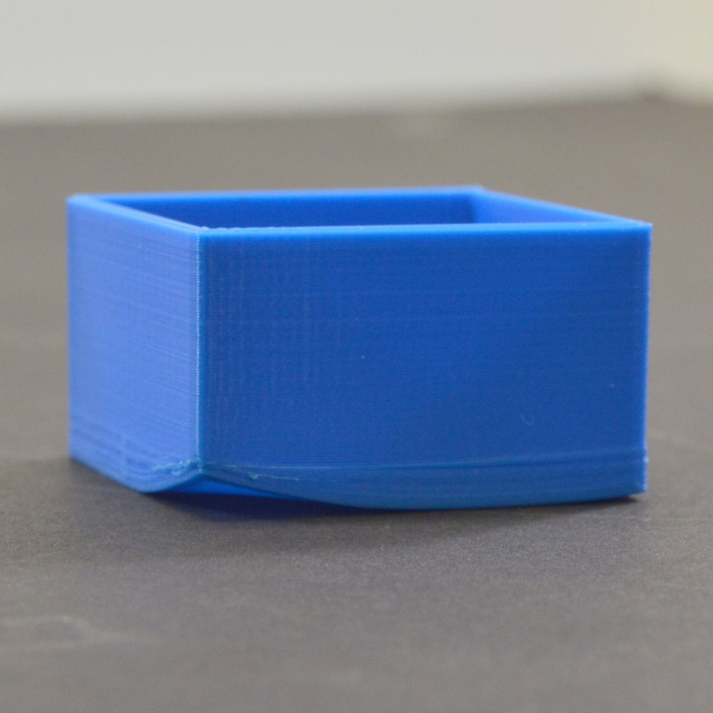

.. _iterating_design:

=======================
Iterating Your Design
=======================

Common Issues
=============

No one gets it on the first try. You should expect to encounter failures, but it's important you learn from them. This section assumes you've already prepared your model as described in :ref:`preparing_to_print`.

If something isn't working, don't just try again; instead, take a step back and analyze the problem. Start by checking for these common issues, then adjust your design or slicing settings accordingly.

Common Print Failures and How to Respond
-----------------------------------------

Warping
^^^^^^^

**Symptom:**
Corners lifting off the bed, or sometimes the entire print can lift from the bed completely.

**Possible causes:**
Poor first-layer adhesion; bed temperature too low

**What to try:** (in order)
  #. Add a one-layer brim in slicer settings to expand contact area.
  #. Increase bed temperature by 5 °C in your slicer settings.
  #. Increase first-layer height or width (e.g., 120 % extrusion width or 0.24 mm layer height).
  #. If you've tried everything else, ask a TA or DFX employee to apply 3D printing adhesive to the build plate. **Do not** attempt to do this yourself.

   Example of warping where corners have lifted from the build plate. [#simplify3d]_

Layer Shifts
^^^^^^^^^^^^

**Symptom:**
Layers misaligned horizontally during print

**Possible causes:**
Print speed or motion settings too aggressive

**What to try:**
 - Reduce print speed by 10-20 mm/s in your slicer.
 - Ensure the wheels of the printer rack are locked so it can't move during printing.

   Example of layer shifts where layers are displaced horizontally during printing. [#bambulab]_

Stringing
^^^^^^^^^

**Symptom:**
Fine threads or hairs between printed features

**Possible causes:**
Insufficient support; nozzle temperature too high

**What to try:**
 - Check supports, especially overhangs (areas with no material beneath).
 - Lower nozzle temperature by 5-10 °C.

   Example of stringing with thin plastic threads connecting separate print features. [#unionfab]_

.. tip::
   Keep a simple log of each failed print: iteration number, slicer changes, and outcome. Over time you'll build a personal troubleshooting database.

.. quizdown:: ../quizzes/3d_printing/iterating_design_check.md

Design-Test-Repeat Mindset
==========================

Iteration is the heart of 3D-printing success. Each cycle refines your part's fit, finish, or function:

#. **Design**
   Model your part in CAD. Save each file with the version number as `part_v1...`, `part_v2...`, etc., so you can track changes.
#. **Evaluate**
   Measure critical dimensions with calipers from the lab toolbox; inspect surface quality and structural integrity.
#. **Adjust**
   Slightly tweak your CAD or slicer profile: wall thickness, bridging angles, infill percentage, etc.
#. **Repeat**
   Re-slice, re-print, and re-evaluate. Each loop should converge toward a reliable, high-quality part.

Next Steps
==========

Once you're comfortable with troubleshooting, explore turning 'working' designs into 'optimized' designs:

- Identify which aspects of your print could be improved—strength, appearance, fit, or ease of assembly.
- Analyze and eliminate empty space, weak structural points, and tolerances.
- In your CAD software, try adding features like fillets/chamfers, screw-holes for easier assembly, and more.

3D printing makes it extremely easy to iterate your designs. Embracing this process will help you become a highly effective designer and printer. For examples to test your skills, see :ref:`project_examples_and_challenges`.

.. quizdown:: ../quizzes/3d_printing/iterating_design_quiz.md

.. rubric:: References

.. [#simplify3d] Source: Simplify3D - Print Quality Troubleshooting Guide
.. [#bambulab] Source: Bambu Lab Wiki - Layer Shifts Knowledge Sharing
.. [#unionfab] Source: Unionfab - Boost Your 3D Print Quality: Tips and Tricks
