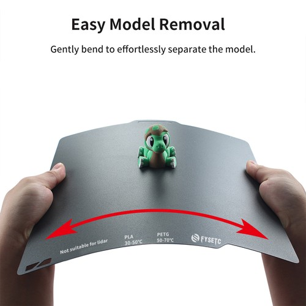
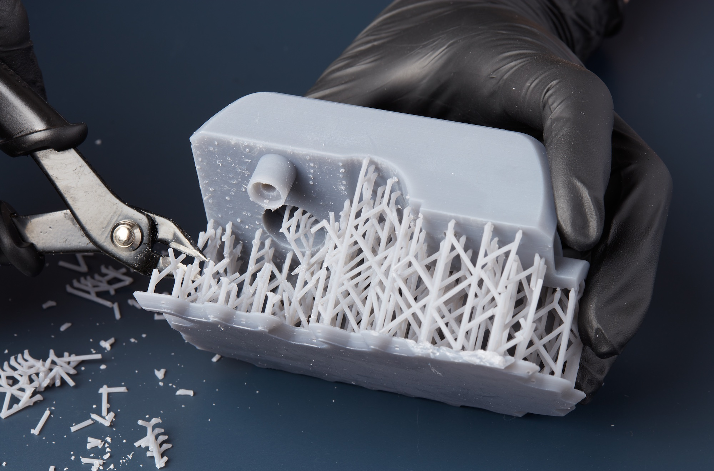

.. _removing_cleaning_prints:

Removing & Cleaning Your Prints
================================

Getting Your Print Off the Bed
-------------------------------

Improper removal can easily damage both your print and our 3D printers. Follow these steps to remove your part safely:

1. **Wait for the bed to cool fully.**  
   Right after a print finishes, the build plate can be over 60°C (140°F). At this temperature, the plastic is still soft and slightly malleable, which can make removal difficult and risk deforming the bottom layers. Letting the plate and part cool not only prevents burns—it also allows the plastic to stiffen and naturally release from the surface, making removal much easier and cleaner.

2. **If it’s stuck, flex with care.**  
   Our printers use removable magnetic plates. Remove the build plate using the tab on the front, bend it just enough to pop the print loose, then immediately put it back.

.. important::
   **Always put the plate back on the printer afterwards.** Do not walk away from the printer with the plate in hand. Warped, lost, or misplaced plates will result in revocation of your printing privileges, a replacement fee, and further consequences.

   Flexing the build plate to safely remove a finished print. [#geekbuying]_

Removing Supports
-----------------

Supports help complex shapes print cleanly—but they must come off gently:

1. **Snip large supports first.**  
   In the lab toolbox, you’ll find flush-cutters. Use them to remove the biggest “trees” of support.

2. **Twist off finer supports by hand.**  
   Grip small struts between thumb and forefinger and twist along the layer lines until they release.

3. **Trim leftover nubs.**  
   If you have an x-acto knife, carefully make several shallow cuts—always pointing the blade away from you.

.. tip::
   For stubborn supports, try gently rocking them back and forth along the layer lines instead of pulling straight out. This reduces the risk of damaging your print and helps the supports break away cleanly.

   Snipping and removing supports from a finished print. [#formlabs]_

Final Cleanup & Lab Courtesy
----------------------------

- **Clean up excess PLA.**  
  There's a dedicated PLA disposal bin close to the printers. Any leftover filament from nozzle cleaning, rafts, or supports on the plate should be removed and properly disposed of.

- **Optional sanding.**
  If desired, use fine-grit sandpaper (220–400) to smooth rough spots. Sand gently over a trash bin to catch dust; do not breathe in the particulate. The print labs do not provide sandpaper.

- **Inspect under good light.**  
  Hold your print up to a bright light source to check for layer-shifts, incomplete details, and any other imperfections.

- **Return tools and final check.**  
  Return any tools to their designated places. Before leaving the lab ensure the printer you used has a clean, properly installed build plate.

.. rubric:: References

.. [#geekbuying] Source: geekbuying.com
.. [#formlabs] Source: Formlabs Support

