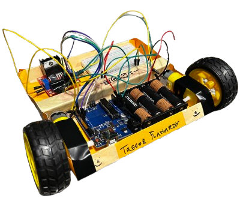
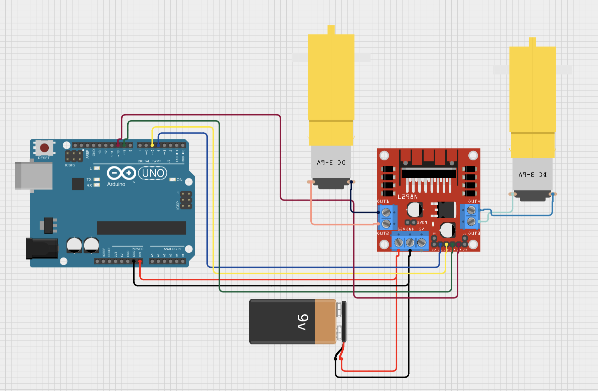

.. _origami_bot:

The Origami Bot
===============

The Origami Bot is an introduction to building your first robot in Foundations of Engineering.
It is a simple robot that can move forward, backward, and turn. Throughout this document, you will learn about the materials needed to construct the robot, how the robot works, and common issues that may arise when building the robot.

    An example of the Origami Bot. Ths robot is built using orange weighted card stock paper and has a personalized design on the front.

.. note::

    Note that this section does **not** detail the full assembly instructions, nor is it a complete guide to finishing your assignment. This document is meant to provide additional information and resources to help you build the robot.

Building the Origami Bot
-------------------------

For specific chassis building instructions, refer to the Origami Bot Instructions PDF on Canvas and/or
the `Dr. Freidkes's Building the Origami Robot <https://www.youtube.com/watch?v=yOe0VYiVKno>`_ YouTube video.

However, we will detail the materials and electronics needed to build the robot below, as well as important information that may help you when building the robot.

Materials
^^^^^^^^^

The following hardware and software are needed to build the Origami Bot:

- **Two pieces** of approximately **8.5" x 11" shipping cardboard box** or a **110-lb weighted Card stock** paper to be used for the chassis structure.
- One **ink pen** and **one ruler** for measuring and marking folds
- One **roll of masking tape**, **two zip ties**, and **8 Velcro squares for assembly**. Zip ties and Velcro squares are included in your project kit already, but you may need masking tape if Electrical Tape does not work for you.
- One **single-hole puncher** used to create access points for motor mounting and attachment. Poking a pencil through the paper will also work.
- One pair of scissors.
- Laptop computer with the Arduino IDE software downloaded.
- Pre-written script downloaded from Canvas for simple follower behavior (or below).
- Markers for the personalization of your robot chassis (required).

Electronics
^^^^^^^^^^^

The Origami Bot uses the following electronic components:

- **Two DC motors** with **wheels** attached.
- **One H-Bridge** to control the motors.
- **One Arduino Uno** to control the H-Bridge.
- **One breadboard** to connect the H-Bridge and Arduino to power.
- **4 AA batteries** to power everything.
- **One battery holder** to hold the batteries.
- **Jumper wires** to connect the components together.

Electronic Schematic
"""""""""""""""""""""

The schematic for the Origami Bot is shown below. Understanding this schematic is crucial for successful assembly and troubleshooting.

    The schematic for the Origami Bot. Follow the wire connections to connect the H-Bridge, Arduino, and motors together.

**Reading the Schematic - Key Points:**

.. important::
    **Power Setup**: The circuit uses two power levels:
    
    - **5V**: Arduino control signals
    - **6V**: Battery power for motors (more power = faster motors)
    
    **Critical Rule**: Always connect external power to Arduino's **VIN pin**, never the 5V pin!

**Why 6V Battery Power Matters:**

- Arduino pins can only provide ~20mA of current
- Motors need 100-200mA to spin properly  
- 6V battery pack provides the extra power motors need

.. warning::

    The **Origami Bot PDF** on Canvas does **not** use this schematic. Instead, it removes the breadboard by supplying power directly from the battery pack to the H-Bridge. The H-Bridge then supplies power to the Arduino.

    This is a more advanced setup, you can use whichever schematic/setup you prefer. The Foundations TAs can help you with either setup. To remove the breadboard, do the following:

    - Supply the power and ground from the battery pack to the H-Bridge, noting that the power from the battery must be plugged into the ``12V`` terminal on the H-Bridge.
    - Supply power to the Arduino from the H-Bridge using the ``5V`` terminal on the H-Bridge into the ``VIN`` pin on the Arduino. This will power the Arduino.

**Power Supply Calculations:**

4 AA batteries = 4 × 1.5V = 6V total (more power than Arduino's 5V)

.. important::

    This schematic shows the use of the ``6V`` power supply. You can also use a ``9V`` battery and the included adapter in your Project kit.

    Additionally, you can power the robot using the USB cable connected to your computer. However, this requires you to change the wiring on your circuit. The Foundations TAs can help you with this if needed, but the ``6V`` or ``9V`` power supply is recommended.

Note how the H-bridge and Arduino power and ground are connected to the breadboard. An Arduino Uno
can only supply ``5V`` of power. But, the four ``AA`` batteries can supply 6V of power (``1.5V * 4V = 6V``).

The H-bridge, however, can handle up to ``46V`` of power! In other words, the H-bridge
loves power! A higher supply of power means the motors can run faster and have more torque.
So, by plugging the H-bridge and Arduino Uno into the breadboard, you can power the motors with ``6V`` of power instead of ``5V``.

**Critical Wiring Rule:**

.. important::
    **VIN vs 5V Pin**: Because you're using 6V batteries, you must connect power to Arduino's **VIN pin**, not the 5V pin.
    
    - **VIN pin**: Can handle 6-12V (has built-in voltage regulator)
    - **5V pin**: Only for 5V - connecting 6V here will damage the Arduino!

Plugging Wires into H-Bridge Screw Terminals
""""""""""""""""""""""""""""""""""""""""""""

Notice how the power, ground, and motor wires are connected to the H-Bridge in the schematic.

.. figure:: ../images/l298_h_bridge_closeup.png
    :alt: L298 H-Bridge Closeup
    :figwidth: 60%
    :align: center

    A closeup of the L298 H-Bridge showing the screw terminals.

They are connected to the screw terminals on the H-Bridge. To connect a wire to the H-Bridge, you
will need to use the screwdriver provided in your kit. Loosen the screw on the H-bridge, insert the end of a **male wire** into the terminal, and then tighten the screw to hold it in place.

.. warning::

    Do not over tighten the terminal screws. This can damage the wire and make it difficult to remove the wire later.

    Make sure the male end of the jumper wire is in the metal terminal. It is common to accidentally insert the wire into the plastic housing of the terminal.

Robot Turning Behavior
----------------------

How does the Origami Bot turn with only two wheels?

The Origami Bot turns by rotating one wheel forward and the other wheel backward (or vice-versa).
This is a **differential steering** design, which is when a robot's motors and aligned and inverted.

Why is this design used?
^^^^^^^^^^^^^^^^^^^^^^^^

This design is **simple and effective**. It is easy to implement (even with 4 wheels), works well, and is consistent in tests. Think to your final project: you will need to build a robot that can turn.

A follower robot must be able to make turns in order to follow a line, a person, a light, or similar
object. You can use the principle of differential steering to make your robot turn.

Important FAQs and Notes
------------------------

Notes
^^^^^

Below show important notes about building the Origami Bot and common issues you will encounter
when building the robot.

Plugging in the DC Motors
""""""""""""""""""""""""""

You'll notice on the top of the DC motors that there are two metal prongs. These prongs are used to
connect the motor to the H-Bridge.

.. figure:: ../images/dc_motor_closeup.png
    :alt: DC Motor Closeup
    :figwidth: 60%
    :align: center

    A closeup of the DC motor showing the two metal prongs.

Take a male to male jumper wire. Connect one end of the prong to the motor and the other end to the
H-Bridge. Repeat this process for the other motor.

.. tip::

    Bend the jumper wire **around** the prong to ensure a secure connection. Then, use **electrical tape** to help hold it in place! This will prevent the wire from coming loose during operation.

    For advanced builders, you can cut the wire to expose its metal core, then **wrap it around the prong** and use electrical tape or solder to secure it in place. Be careful doing this!

.. important::

    The two wires that connect to the motor must both plug into the **same side** on the H-Bridge.

Backward Motor Rotation
""""""""""""""""""""""""

When you plug in the DC motors, you may notice that they rotate in the wrong direction during your tests.
This is because the motors are **polarized**. If you plug in the motor and it rotates in the wrong direction,

- **Switch the wires** on the H-Bridge that connect to the motor.
- **Switch the wires** on the motor that connect to the H-Bridge.

By switching the wires, you can change the direction of the motor's rotation. We recommend
**changing the wires on the H-Bridge** as it is easier to access and change.

FAQs
^^^^

**Simple Troubleshooting Steps**

**If Motors Don't Work:**

1. **Check power**: Are batteries connected? Does Arduino LED light up?
2. **Wiggle motor wires**: Loose connections are the #1 problem
3. **Check motor wires**: Both motor wires must connect to same H-bridge side
4. **Check grounds**: Arduino and H-bridge must share ground connection

**If Motor Spins Wrong Direction:**

Simply swap the two motor wires on the H-Bridge terminals - this is normal!

**When Motors Work Sometimes:**

- Check battery voltage with multimeter (should read ~6V)
- Tighten H-Bridge screw terminals
- Re-seat breadboard connections

**Still Not Working?**

Ask TAs for help and mention:
- Which troubleshooting steps you tried
- Whether it affects one or both motors
- What your multimeter shows for battery voltage

.. seealso::
    For detailed electrical troubleshooting: :ref:`Circuit Troubleshooting Guide <electrical_troubleshooting>`

Can I Use a 3D Printer or Other Chassis Type?
"""""""""""""""""""""""""""""""""""""""""""""

As fun as that would be, the assignment is locked regarding the chassis type. You can use paper or cardboard to build your chassis, but you cannot use a 3D printer or other materials.

Additional Resources
--------------------

For additional resources on building the Origami Bot, refer to the following:

- The **Origami Bot Instructions** PDF on Canvas.
- Dr. Freidkes's **Building the Origami Robot** `YouTube video <https://www.youtube.com/watch?v=yOe0VYiVKno>`_.
- `Dr. Schlaf's video <https://youtu.be/j6D9-GKhAyc?si=DjsJl7CnlX8HYTyr&t=959>`_ demonstrating how to use the h-bridge motor controller, you may start watching from ``15.59" - end``.
- The :ref:`Origami Bot Code <origami_bot_code>` below.
- The :ref:`H-Bridge Control Example <h_bridge>` in The Arduino Guide for more information on controlling DC motors with an H-Bridge.
- :ref:`Circuit Troubleshooting Guide <electrical_troubleshooting>` for systematic debugging help.

.. _origami_bot_code:

Origami Bot Code
----------------

An updated version of the Origami Bot code is provided below. This has been expanded to include
additional comments about what the code is doing, as well as align with The Arduino Guide's
standards.

Upload the code to your Arduino, and then test your robot using its power supply to check if it is working correctly. You do not need to keep the Arduino plugged into your computer to test the robot.

.. whole-literal-include:: ../../examples/assignments/origami_bot.ino
    :language: cpp