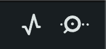
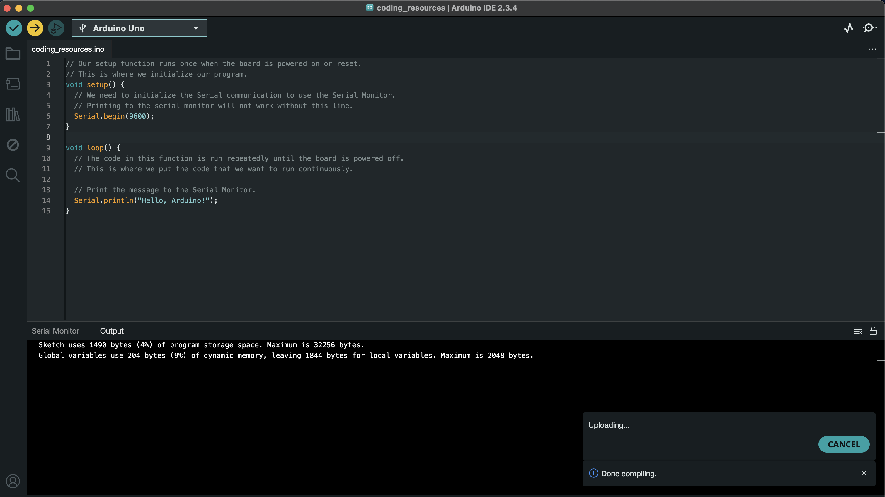
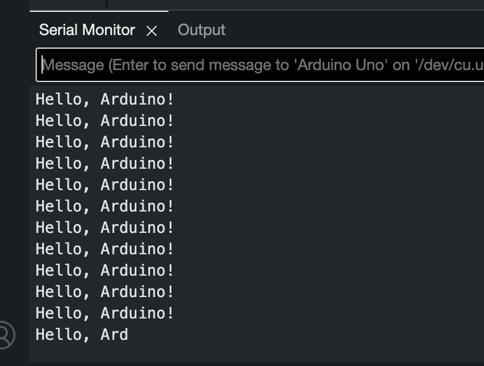

.. _first_arduino_program:

Your First Arduino Program
==========================

Believe it or not, you now know everything you need to write **many**
different types of Arduino programs!

The only way to truly learn programming is by doing, so let's dive in
and write a simple program to get you started. Don't worry if you don't
have everything yet; the goal is to get you comfortable with the process
of writing and running code, so follow along as best you can.

Remember, this book is designed to be a guide, not a rule book. Feel
free to experiment, make mistakes, and learn from them. The more you
practice, the more comfortable you'll become with programming!

Let's write a simple program that prints “Hello, Arduino!” to the Serial
Monitor. This program will introduce you to the basic structure of an
Arduino sketch and how to use the ``Serial`` functions for debugging.

Step 1: Open the Arduino IDE and Create a New Sketch
----------------------------------------------------

If you haven't already, open the Arduino IDE on your computer. You
should see a blank sketch window where you can write your code.

On the left side of the window, you'll see a toolbar with icons for
common actions like opening multiple sketches, saving your work, and
uploading code to your Arduino board. Click on the folder icon to open
the Sketchbook, then click on the “New Sketch” button at the bottom of
the window to create a new sketch.

.. figure:: ./images/new_sketch.png
   :alt: Arduino IDE with New Sketch

   Arduino IDE with New Sketch

You should have a new window with an empty sketch ready for you to write
your code. In it, you'll see two functions: ``setup()`` and ``loop()``.
As discussed in :ref:`special built in
functions <special_built_in_functions>`, these functions are
automatically created for you when you create a new sketch. This is
where you'll write your code.

Step 2: Write the Program
-------------------------

Let's write the code for our first Arduino program. Thinking back again
to the :ref:`special built in
functions <special_built_in_functions>`, we
know that we need to use the ``Serial`` functions to print messages to
the Serial Monitor. Here's the code for our program:

Thus,

.. whole-code-block:: cpp

   // Our setup function runs once when the board is powered on or reset.
   // This is where we initialize our program.
   void setup() {
      // We need to initialize the Serial communication to use the Serial Monitor.
      // Printing to the serial monitor will not work without this line.
      Serial.begin(9600);
   }

   void loop() {
      // The code in this function is run repeatedly until the board is powered off.
      // This is where we put the code that we want to run continuously.

      // Print the message to the Serial Monitor.
      Serial.println("Hello, Arduino!");
   }

.. tip::

   Remember: the comments we add do not affect our program. If you wish,
   you can remove them.

.. figure:: ./images/new_program.png
   :alt: Arduino IDE with First Program

   Arduino IDE with First Program

Step 3. Open the Serial Monitor
-------------------------------

In the top right of your IDE, you should see a magnifying glass icon.
This is the toggle to show and hide the Serial Monitor window.

   Magnifying Glass Icon

Click on it to open the Serial Monitor window.

.. figure:: ./images/serial_monitor_open.png
   :alt: Serial Monitor Open

   Serial Monitor Open

.. _example_1_upload_and_run_the_program:

Step 4. Upload and Run the Program
----------------------------------

With your Arduino Uno plugged into your computer, select the correct
board and port from the “Tools” menu in the Arduino IDE. You can find
the board and port options under the “Tools” menu. Select the board type
(Arduino Uno) and the port your board is connected to.

.. figure:: ./images/selecting_arduino_uno.png
   :alt: Selecting the Arduino Uno

   Selecting the Arduino Uno

After, click the “Upload” button (the right arrow icon) to compile and
upload your code to the Arduino board. You should see the status
messages at the bottom of the IDE as the code is compiled and uploaded.

   Uploading the Code

Click back onto the Serial Monitor tab at the bottom, and you can see
“Hello, Arduino!” printed in the Serial Monitor. This is the message
that we printed in our code.

.. figure:: ./images/seeing_first_program.png
   :alt: Seeing your first program

   Seeing your first program

   Closeup of seeing your first program

Congrats! You've just written and run your first Arduino program. This
is a simple example, but it's a great starting point for learning more
about programming and working with Arduino.

.. quizdown:: quizzes/first_program_quiz.md
