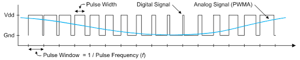

.. _introduction:

Introduction to Arduino Programming
===================================

This section introduces the Arduino programming language and the Arduino platform used throughout the course. You'll learn what a programming language is, why it's important, and how it fits alongside the circuit design and fabrication work you'll be doing in the Engineering Lab. By the end of this section, you'll have a solid understanding of the fundamentals of Arduino programming and be ready to integrate them into more advanced topics.

What is a Programming Language?
-------------------------------
A programming language is a formal system of communication used to give instructions to a computer. Just as spoken or written languages allow humans to communicate with one another, programming languages enable humans to communicate with machines. These instructions are written in a specific "syntax" that the computer can interpret and execute.

In many ways, programming languages are similar to human languages. They have rules for structure and grammar, known as **syntax**, which must be followed for the instructions to make sense. However, unlike human languages, programming languages are highly precise, leaving no room for ambiguity. A single misplaced character or incorrect command can result in errors! Don't worry, we have tools to help you catch these errors, and we'll cover them in this book.

Programming languages serve various purposes, from automating repetitive tasks to building complex systems like websites, games, and embedded devices. Arduino's programming language is designed to simplify communication with "hardware" (the physical components of a computer or electronic system that you can see and touch, like circuit boards, wires, and sensors), allowing you to control electronic components like LEDs, motors, and sensors with ease.

Think of a programming language as a bridge between your ideas and a machine's capabilities. By learning the Arduino programming language, you'll gain the tools to turn your ideas into functional, tangible projects that interact with the circuits and parts you create.

Arduino Platform Overview
-------------------------

Arduino is an "open-source" (fancy word for publicly available and editable) platform that combines both hardware and software, making it a powerful tool for building electronic projects. It is widely used in education, prototyping, and hobbyist projects because of its simplicity and versatility. The hardware consists of microcontroller boards, which act as the "brains" of your projects, while the software provides the tools to write, upload, and run code on these boards.

In the Foundations of Lab Engineering Course, your microcontroller board is the **Arduino Uno**, a popular choice for beginners due to its ease of use and extensive community support. The software you'll write will be done in an "**Integrated Development Environment**" (IDE) specifically designed for Arduino programming. This IDE provides a user-friendly interface for writing code, uploading it to the board, and monitoring its behavior. Think of an IDE as a special computer program that's meant for writing code and running it on your Arduino board.

The Arduino programming language is based on a widely used programming language named C++. While C++ itself can be complex, the Arduino Programming Language makes coding easy simplifying the complex C++ to work with electronic components. This allows you to focus on learning the core concepts of programming and how they interact with hardware.

By learning the Arduino Programming Language, you're not just learning to code—you're learning to connect the digital world to the physical one, turning abstract concepts into real-world results.

.. note::

    **Advanced: An Programmer's Introduction to Arduino [OPTIONAL]**: In essence, the Arduino programming language is a subset of C++. Due to this, Arduino abstracts many C++ concepts and provides a simplified framework for working with hardware. This framework includes built-in functions and libraries that handle low-level tasks, such as reading sensor data or controlling motors. The skills you already know in C++ apply, making it easier to transition between the two.

Arduino Programming Language Files
~~~~~~~~~~~~~~~~~~~~~~~~~~~~~~~~~~

When you write code for an Arduino board, you create a **sketch**. An Arduino sketch is a text file that contains the code you write to control the board's behavior. The sketch is saved with a ``.ino`` extension, and it is the primary way to interact with the Arduino board.

Arduino Board Pin Types
~~~~~~~~~~~~~~~~~~~~~~~~

Arduino boards have different types of pins, each serving specific purposes. Understanding these pin types is crucial for connecting components to the board and writing code to control them effectively. Below are the main types of pins you’ll encounter:

#. **Digital Pins**:

   Digital pins can be set to either ``HIGH`` (``5V``) or ``LOW`` (``0V``). These pins are used for digital input and output operations, meaning they work with binary signals: either ``ON`` (``HIGH``) or ``OFF`` (``LOW``).

   Digital pins can interact with components like:

   - Buttons (to detect presses as ``HIGH`` or ``LOW``)
   - LEDs (to turn them ON or OFF)
   - Relays (to control power to devices)

   **PWM (Pulse Width Modulation):**

   Some digital pins on Arduino boards are marked with a ``~`` symbol (e.g., ``~3``, ``~5``, ``~6``). These are PWM-enabled pins. PWM allows you to simulate an analog output using a digital signal.

   - **How PWM Works**: PWM rapidly toggles a digital pin between HIGH and LOW at a specific frequency. By adjusting the proportion of time the pin stays HIGH (called the pulse width), you can simulate different output voltages.
   - **Common Uses**: PWM is commonly used to:
     - Dim LEDs by controlling their brightness.
     - Control motor speed.
     - Generate audio signals for buzzers or speakers.

#. **Analog Pins**:

Analog pins are used to read analog signals and convert them to digital values through a process called analog-to-digital conversion (ADC). These pins can detect a range of voltages (typically ``0-5V`` on most boards) and return a value between 0 and 1023.

**When to Use Analog Pins:**

Reading data from sensors like temperature, light, or potentiometers, which provide varying voltage outputs.

Analog vs. PWM: What's the Difference?
^^^^^^^^^^^^^^^^^^^^^^^^^^^^^^^^^^^^^^^

Consider the following image:

In **blue** you see the ``Analog`` signal. This signal is continuous and can take any value within a range (e.g., ``0-5V``). Analog pins are used to read these continuous signals and convert them to digital values.

In **black**, you see the ``PWM`` signal. This signal is digital and can only take two values: ``HIGH`` or ``LOW``. However, by adjusting the pulse width (the proportion of time the signal stays ``HIGH``), you can simulate different output voltages. PWM pins are used to control components that require variable output voltages, like LEDs or motors.

To sum this:

.. list-table::
    :header-rows: 1

    * - Feature
      - Analog Pins
      - PWM Pins
    * - Purpose
      - Reads continuous voltage.
      - Simulates variable output voltage.
    * - Type
      - Input only
      - Output only (digital signal).
    * - range
      - ``0-1023`` (based on ``0-5V``).
      - ``0-255`` (based on pulse width).
    * - Use Cases
      - Reading sensor data.
      - Controlling brightness or audio signals.