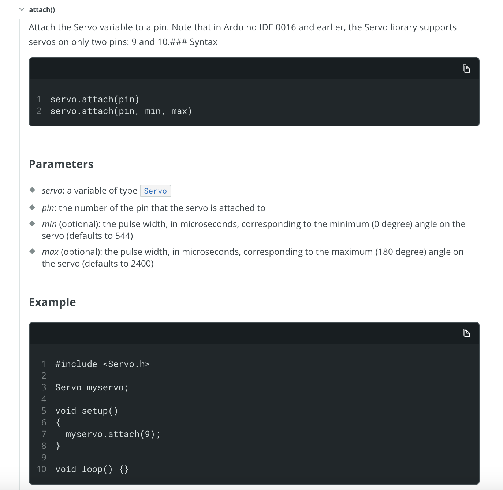

.. _libraries:

Libraries
=========

What is a Library
-----------------

In Arduino programming, a **library** is like a toolkit that adds extra
functionality to your code. Libraries are **collections of pre-written
code** that handle specific tasks, saving you from writing everything
from scratch. They let you easily use complex features like controlling
sensors, displays, or communication modules.

Think of a library as a recipe book: instead of figuring out how to bake
a cake (write all the code), you can just follow the recipe (use the
library functions). In a coding context, **libraries are simply reusing
code that someone else has written to save you time and effort.**

Why Use Libraries?
------------------

- **Saves Time**: Avoid reinventing the wheel; libraries provide ready-made solutions.
- **Simplifies Code**: Libraries abstract away the complex details, making your code cleaner and easier to read.
- **Enables Advanced Features**: Use libraries to control hardware components or implement communication protocols without needing in-depth knowledge of how they work internally.

How to Use a Library
--------------------

Using libraries in Arduino is a great way to extend the functionality of
your projects without having to write all the code yourself. Libraries
are collections of pre-written code that make it easy to perform common
tasks. To learn how to use a library, let's look at an example using the
``Servo`` library to control a servo motor.

Including a Library
~~~~~~~~~~~~~~~~~~~

To use a library in your Arduino sketch, you need to **include** it at
the beginning of your code. This tells the Arduino IDE to load the
library and make its functions available for use.

For example, the Arduino IDE includes a ``Servo`` library built in to
easily control, as you can guess, servos. Your project kit has a servo.
Let's say you wanted to control a servo monitor. In your code, you have
to **include** the ``Servo`` library to your code.

.. code:: cpp

   #include <Servo.h>

``Servo.h`` is the **header file** for the ``Servo`` library, which
contains the code needed to control servo motors. A **header file** is a
file that contains declarations of functions, classes, and variables
that are defined in a library. The library's creator names the header
file; all you have to do is include it in your code to access the
library's functionality.

.. note::

   Note that the header file name is not always the same as the
   library's name. Sometimes, you install a library under a different
   name from which you import it.

   How do you know which header file to include? The library's documentation will tell you. We will go over this in the next section.

In this case, the ``Servo`` library provides a custom ``Servo`` type and
functions like ``attach()`` and ``write()`` to control the position of
the servo motor.

Including a Library in Arduino
~~~~~~~~~~~~~~~~~~~~~~~~~~~~~~~

The syntax for including a library is:

.. code:: cpp

   #include <LibraryName.h>

These ``#include`` statements always go at the top of your sketch file,
before **any** other code.

.. code:: cpp

   #include <LibraryName.h>

   // Your code goes here
   void setup() {
      // Setup code
   }

   void loop() {
      // Loop code
   }

Using Library Functions
~~~~~~~~~~~~~~~~~~~~~~~

Once you've included a library in your sketch, you can use its functions
to perform specific tasks.

You know what functions a library has by reading the library's documentation! The `Arduino Library
Reference <https://www.arduino.cc/reference/en/libraries/>`__ is a great
place to start. It provides detailed information on each library you can
use on your Arduino, including the functions it contains and how to use
them.

For this course, however, **you will be linked to the specific library
documentation when you need it, or directly told the library's functions
of interest for a given assignment.**

Example: Using the ``Servo`` Library
~~~~~~~~~~~~~~~~~~~~~~~~~~~~~~~~~~~~

Consider the `Servo Library
Documentation <https://docs.arduino.cc/libraries/servo/>`__:

.. figure:: ./images/servo_library_documentation.png
   :alt: Servo Library Documentation

   Servo Library Documentation

At the bottom of the page, you can see the functions (methods) available
in the ``Servo`` library, such as ``attach()``, ``write()``, and
``detach()``. These functions allow you to control the position of a
servo motor.

.. figure:: ./images/servo_library_methods.png
   :alt: Servo Library Methods

   Servo Library Methods

Each function dropdown details the parameters it takes, what it does,
and how to use it. For example, the ``attach()`` function is used to
connect the servo motor to a specific pin on the Arduino board.

   Servo Library Attach Method

To see the use of the ``Servo`` library's methods, see :ref:`Servo Motor
Control <servo_motor_control>`.